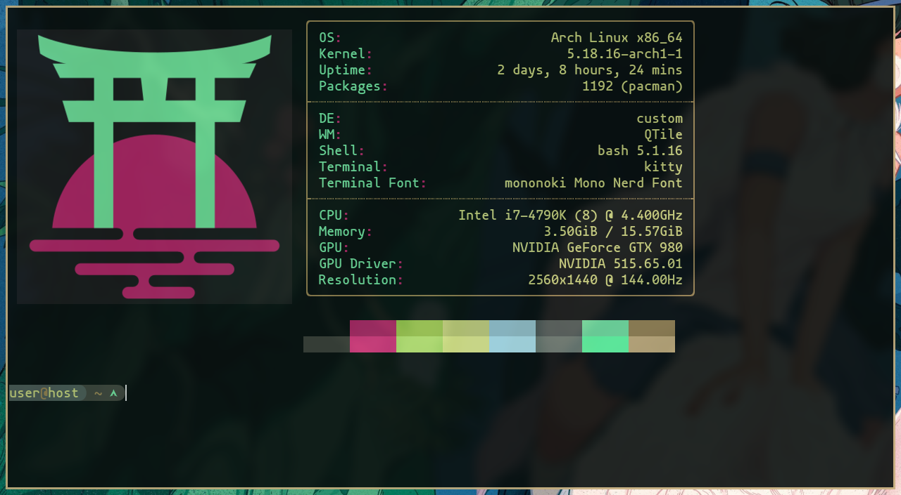

# Mokujin Neofetch Theme
A theme for [neofetch](https://github.com/dylanaraps/neofetch) based on the Mokujin colorway

 


## Screenshots
<sub>wallpaper credit: Dani Pendergast (www.danipendergast.com)</sub>


## Requirements
- Terminal must support image rendering (i.e. kitty)
- Designed for 'mononoki Nerd Font Mono' 15pt
- Designed to be used with the Mokujin terminal palette

## Installation
### Fonts
Other fonts may work; most Nerd Fonts should work, but ymmv.  Installing Nerd Fonts Complete is a good idea.  Your preferred terminal will need to be configured to use it, however.

For arch users, the Nerd Fonts can be found in **aur**.
```
yay -S nerd-fonts-complete
```

### Theme
Just copy `config.conf` and `mokujin_logo_torii_400x400.png` into your neofetch config directory: `~/.config/neofetch` and you're set.


## Troubleshooting
If you're experiencing text rendering issues, make sure the necessary font packages in the requirements section are installed and update your font cache with `fc-cache -f`.  Make sure your terminal is set to use the correct font.  You will probably need to restart your terminal after making changes.


## Contributing
There's probably not much to be done with this, but if you find a bug, let me know.

As always, you can buy me a coffee if you find this software useful and want to say thanks ;)


## License
This software is licensed in two parts.  See LICENSE for details.


